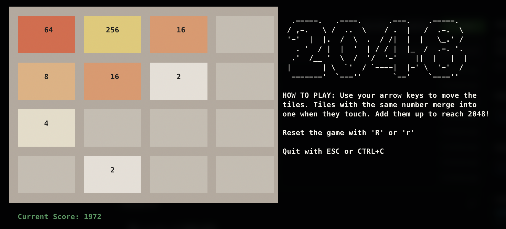

# Terminal 2048

> Play 2048 directly in your terminal or use the Game Controller as a standalone go package.


## Play from the Terminal 

```shell
make build
./2048
```




## Game Controller Interface

`github.com/brandenc40/2048/game`

```go
package game 

// Direction for movement actions
type Direction uint8

const (
	// DirectionLeft moves cells left
	DirectionLeft Direction = iota
	// DirectionUp moves cells up
	DirectionUp
	// DirectionRight moves cells right
	DirectionRight
	// DirectionDown moves cells down
	DirectionDown
)

// Cells that make up the game board
type Cells [4][4]uint16

// Controller for controlling and viewing the game board
type Controller interface {
	// Shift the board in the Direction provided. True is returned if rows were changed, if no action
	// was possible then false is returned
	Shift(direction Direction) (changed bool)
	// Won returns true if the board has a cell equal to 2048
	Won() bool
	// Lost returns true if there are no more possible moves to be made
	Lost() bool
	// GetScore returns the current score of the game
	GetScore() uint32
	// GetCells returns the game board cell values
	GetCells() Cells
	// Reset the game board back to initial state with new random values
	Reset()
}

// NewController builds a new 2048 game board manager
func NewController() Controller
```
